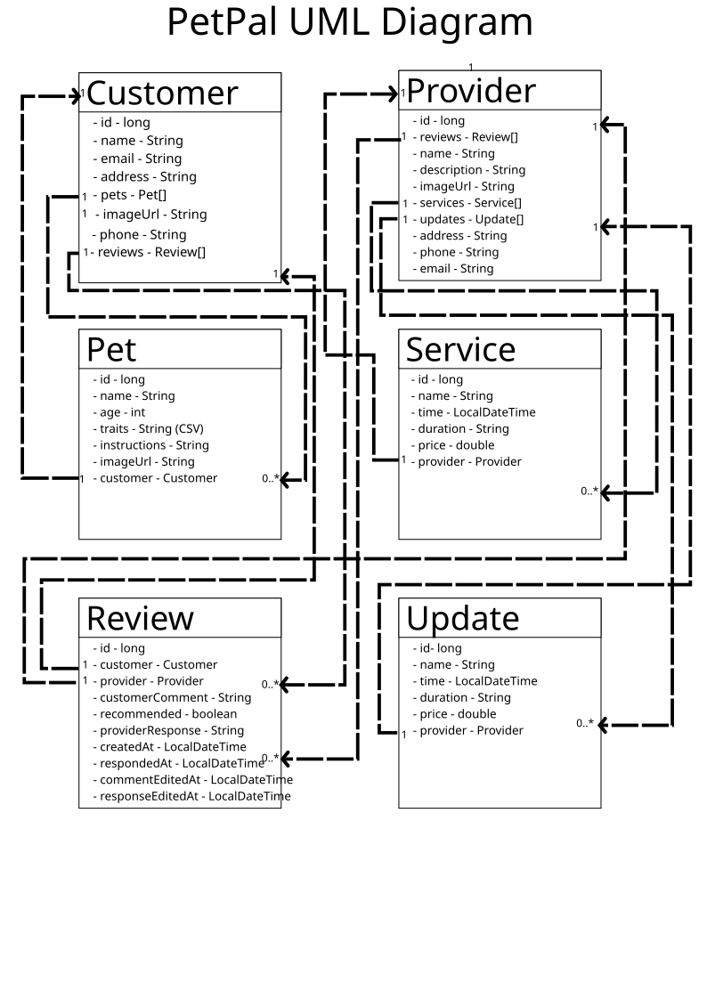

# PetPal Backend API
**Version:** 1.0
**Last Updated:** July 10, 2026

**Base URL:**

- local: http://localhost:8080
- production: https://su26-team8-8soa.onrender.com/

## Table of Contents

1. [Overview](#1-overview)
2. [UML Class Diagram](#2-uml-class-diagram)
3. [API Endpoints](#3-api-endpoints)
   - [Customer Endpoints](#31-Customer-endpoints)
   - [Pet Endpoints](#32-Pets-endpoints)
   - [Jobs Service Endpoints](#33-Jobs-endpoints)
   - [Provider Endpoints](#34-Provider-endpoints)
   - [Review  Endpoints](#35-review-endpoints)
   - [Updates Endpoints](#36-updates-endpoints)
---

## 1. Overview

The PetPal backend exposes a RESTful API for the Pet care platform described in the SRS. It supports customer registration and profile management, Provider discovery, service catalog management, basic updates lookup, and review management.

---

## 2. UML Class Diagram



---


## 3. API Endpoints

Note that all endpoints may or may not end in a forward slash.

### 3.1 Customer Endpoints

#### Get all customers

``` http
GET /api/customers
```

Example response:

```json
[
  {
    "id": 1,
    "name": "name",
    "email": "unique_email",
    "phone": "phone",
    "password": "password"
  }
]
```

#### Get a customer by id

```http
GET /api/customers/{id}
```

Example response:

```json
{
  "id": 1,
  "name": "name",
  "email": "unique_email",
  "phone": "phone",
  "password": "password"
}
```

#### Get a customer's pets

```http
GET /api/customers/{id}/pets
```

Example response:

```json
[
  {
    "id": 1,
    "name": "name",
    "speciesOrBreed": "speciesOrBreed",
    "age": 7,
    "specialCareInstructions": "specialCareInstructions",
    "traits": "traits",
    "customerId": 1,
    "providerId": 2
  }
]
```

#### Get a customer's reviews

```http
GET /api/customers/{id}/reviews
```

Example response:

```json
[
  {
    "id": 1,
    "recommended": true,
    "customerComment": "customerComment",
    "providerResponse": "providerResponse",
    "customerId": 1,
    "providerId": 2
  }
]
```

#### Create a customer

```http
POST /api/customers
```

Request body:

```json
{
  "name": "name",
  "email": "unique_email",
  "phone": "phone",
  "password": "password"
}
```

Example response:

```json
{
  "id": 1,
  "name": "name",
  "email": "unique_email",
  "phone": "phone",
  "password": "password"
}
```

#### Update a customer

```http
PUT /api/customers/{id}
```

Request body:

```json
{
  "name": "name",
  "email": "New email",
  "phone": "phone",
  "password": "password"
}
```

Example response:

```json
{
  "id": 1,
  "name": "New name",
  "email": "email",
  "phone": "phone",
  "password": "password"
}
```

#### Delete a customer

```http
DELETE /api/customers/{id}
```

---

### 3.2 Job Endpoints

#### Get all jobs

```http
GET /api/jobs
```

Example response:

```json
[
  {
    "name": "name",
    "time": "2007-12-03T10:15:30",
    "duration": "duration",
    "price": 0.0,
    "provider": {
      "name": "name",
      "description": "description",
      "imageUrl": "imageUrl",
      "address": "address",
      "phone": "phone",
      "email": "email",
      "id": 3
    },
    "id": 10
  },
  {
    "name": "name",
    "time": "2007-12-03T10:15:30",
    "duration": "duration",
    "price": 0.0,
    "provider": {
      "name": "name",
      "description": "description",
      "imageUrl": "imageUrl",
      "address": "address",
      "phone": "phone",
      "email": "email",
      "id": 3
    },
    "id": 11
  },
  {
    "name": "name",
    "time": "2007-12-03T10:15:30",
    "duration": "duration",
    "price": 0.0,
    "provider": {
      "name": "name",
      "description": "description",
      "imageUrl": "imageUrl",
      "address": "address",
      "phone": "phone",
      "email": "email",
      "id": 3
    },
    "id": 12
  }
]
```

#### Get a job by id

```http
GET /api/jobs/{id}
```

Example response:

```json
{
  "name": "name",
  "time": "2007-12-03T10:15:30",
  "duration": "duration",
  "price": 0.0,
  "provider": {
    "name": "name",
    "description": "description",
    "imageUrl": "imageUrl",
    "address": "address",
    "phone": "phone",
    "email": "email",
    "id": 3
  },
  "id": 10
}
```

#### Create a job

```http
POST /api/jobs/{id}
```

Request body:

```json
{
	"name":"name",
	"time":"2007-12-03T10:15:30",
	"duration":"duration",
	"price":0,
	"providerId":3
}

```

Example response:

```json
{
  "name": "name",
  "time": "2007-12-03T10:15:30",
  "duration": "duration",
  "price": 0.0,
  "provider": {
    "name": "name",
    "description": "description",
    "imageUrl": "imageUrl",
    "address": "address",
    "phone": "phone",
    "email": "email",
    "id": 3
  },
  "id": 15
}
```

#### Update a job

```http
PUT /api/jobs/{id}
```

Request body:

```json
{
	"name":"new name",
	"time":"2007-12-03T10:15:30",
	"duration":"duration",
	"price":3.14
}
```

Example response:

```json
{
  "name": "new name",
  "time": "2007-12-03T10:15:30",
  "duration": "duration",
  "price": 3.14,
  "provider": {
    "name": "name",
    "description": "description",
    "imageUrl": "imageUrl",
    "address": "address",
    "phone": "phone",
    "email": "email",
    "id": 3
  },
  "id": 10
}
```

#### Delete jobs

```http
DELETE /api/jobs
```

---

### 3.3 Pet Endpoints

#### Get all pets

```http
GET /api/pets
```

Example response:

```json
[
  {
    "id": 1,
    "name": "name",
    "speciesOrBreed": "speciesOrBreed",
    "age": 7,
    "specialCareInstructions": "specialCareInstructions",
    "traits": "traits",
    "customerId": 5,
    "providerId": 2
  }
]
```

#### Get a pet by id

```http
GET /api/pets/{id}
```

Example response:

```json
{
  "id": 1,
  "name": "name",
  "speciesOrBreed": "speciesOrBreed",
  "age": 7,
  "specialCareInstructions": "specialCareInstructions",
  "traits": "traits",
  "customerId": 5,
  "providerId": 2
}
```

#### Create a pet

```http
POST /api/pets/
```

Request body:

```json
{
  "name": "name",
  "speciesOrBreed": "speciesOrBreed",
  "age": 7,
  "specialCareInstructions": "specialCareInstructions",
  "traits": "traits",
  "customerId": 5,
  "providerId": 2
}
```

Example response:

```json
{
  "id": 1,
  "name": "name",
  "speciesOrBreed": "speciesOrBreed",
  "age": 7,
  "specialCareInstructions": "specialCareInstructions",
  "traits": "traits",
  "customerId": 5,
  "providerId": 2
}
```

#### Update a pet

```http
PUT /api/pets/{id}
```

Request body:

```json
{
  "name": "new name",
  "speciesOrBreed": "speciesOrBreed",
  "age": 7,
  "specialCareInstructions": "specialCareInstructions",
  "traits": "traits"
}
```

Example response:

```json
{
  "id": 1,
  "name": "new name",
  "speciesOrBreed": "speciesOrBreed",
  "age": 7,
  "specialCareInstructions": "specialCareInstructions",
  "traits": "traits",
  "customerId": 5,
  "providerId": 2
}
```

#### Delete pets

```http
DELETE /api/pets
```

---

### 3.4 Provider Endpoints

#### Get all providers

```http
GET /api/providers
```

Example response:

```json
[
  {
    "name": "name",
    "description": "description",
    "imageUrl": "imageUrl",
    "address": "address",
    "phone": "phone",
    "email": "email",
    "jobs": [],
    "updates": [],
    "reviews": [],
    "id": 4
  },
  {
    "name": "name",
    "description": "description",
    "imageUrl": "imageUrl",
    "address": "address",
    "phone": "phone",
    "email": "email",
    "jobs": [],
    "updates": [],
    "reviews": [],
    "id": 15
  }
]
```

#### Get a provider by id

```http
GET /api/providers/{id}
```

Example response:

```json
{
  "name": "name",
  "description": "description",
  "imageUrl": "imageUrl",
  "address": "address",
  "phone": "phone",
  "email": "email",
  "jobs": [],
  "updates": [],
  "reviews": [],
  "id": 15
}
```

#### Get a provider's jobs

```http
GET /api/providers/{id}/jobs
```

Example response:

```json
[
  {
    "name": "name",
    "time": "2007-12-03T10:15:30",
    "duration": "duration",
    "price": 0.0,
    "provider": {
      "name": "name",
      "description": "description",
      "imageUrl": "imageUrl",
      "address": "address",
      "phone": "phone",
      "email": "email",
      "id": 3
    },
    "id": 11
  },
  {
    "name": "name",
    "time": "2007-12-03T10:15:30",
    "duration": "duration",
    "price": 0.0,
    "provider": {
      "name": "name",
      "description": "description",
      "imageUrl": "imageUrl",
      "address": "address",
      "phone": "phone",
      "email": "email",
      "id": 3
    },
    "id": 12
  }
]
```

#### Get a provider's updates

```http
GET /api/providers/{id}/updates
```

Example response:

```json
[
  {
    "title": "title",
    "createdAt": "2026-07-10T19:43:34.583288",
    "description": "description",
    "provider": {
      "name": "name",
      "description": "description",
      "imageUrl": "imageUrl",
      "address": "address",
      "phone": "phone",
      "email": "email",
      "id": 3
    },
    "id": 14
  },
  {
    "title": "title",
    "createdAt": "2026-07-10T19:43:34.715738",
    "description": "description",
    "provider": {
      "name": "name",
      "description": "description",
      "imageUrl": "imageUrl",
      "address": "address",
      "phone": "phone",
      "email": "email",
      "id": 3
    },
    "id": 15
  }
]
```

#### Get a provider's reviews

```http
GET /api/providers/{id}/reviews
```

Example response:

```json
[
  {
    "recommended": true,
    "customerComment": "customerComment",
    "providerResponse": null,
    "createdAt": "2026-07-10T19:36:24.92159",
    "respondedAt": null,
    "commentEditedAt": null,
    "responseEditedAt": null,
    "customer": {
      "name": "name",
      "email": "unique_email",
      "phone": "phone",
      "password": "password",
      "id": 4
    },
    "provider": {
      "name": "name",
      "description": "description",
      "imageUrl": "imageUrl",
      "address": "address",
      "phone": "phone",
      "email": "email",
      "id": 4
    },
    "hasResponse": false,
    "id": 11,
    "wasEdited": false,
    "wasResponseEdited": false
  }
]
```

#### Create a provider

```http
POST /api/providers/
```

Request body:

```json
{
	"name":"name",
	"description":"description",
	"imageUrl":"imageUrl",
	"address":"address",
	"phone":"phone",
	"email":"email"
}
```

Example response:

```json
{
  "name": "name",
  "description": "description",
  "imageUrl": "imageUrl",
  "address": "address",
  "phone": "phone",
  "email": "email",
  "jobs": [],
  "updates": [],
  "reviews": [],
  "id": 16
}
```

#### Update a provider

```http
PUT /api/providers/{id}
```

Request body:

```json
{
	"name":"new name",
	"description":"description",
	"imageUrl":"imageUrl",
	"address":"address",
	"phone":"phone"
}
```

Example response:

```json
{
  "name": "new name",
  "description": "description",
  "imageUrl": "imageUrl",
  "address": "address",
  "phone": "phone",
  "email": "email",
  "jobs": [],
  "updates": [],
  "reviews": [],
  "id": 16
}
```

#### Delete a provider

```http
DELETE /api/providers/{id}
```

---

### 3.5 Review Endpoints

#### Get all reviews

```http
GET /api/reviews
```

Example response:

```json
[
  {
    "id": 1,
    "recommended": true,
    "customerComment": "customerComment",
    "providerResponse": "providerResponse",
    "customerId": 4,
    "providerId": 4
  }
]
```

#### Get a review by id

```http
GET /api/reviews/{id}
```

Example response:

```json
{
  "id": 1,
  "recommended": true,
  "customerComment": "customerComment",
  "providerResponse": "providerResponse",
  "customerId": 4,
  "providerId": 4
}
```

#### Create a review

```http
POST /api/reviews/
```

Request body:

```json
{
  "recommended": true,
  "customerComment": "customerComment",
  "customerId": 4,
  "providerId": 4
}
```

Example response:

```json
{
  "id": 1,
  "recommended": true,
  "customerComment": "customerComment",
  "providerResponse": null,
  "customerId": 4,
  "providerId": 4
}
```

#### Update a review comment

```http
PUT /api/reviews/{id}
```

Request body:

```json
{
  "recommended": false,
  "customerComment": "customerComment"
}
```

Example response:

```json
{
  "id": 1,
  "recommended": false,
  "customerComment": "customerComment",
  "providerResponse": null,
  "customerId": 4,
  "providerId": 4
}
```

#### Create a provider response

```http
POST /api/reviews/{id}/response
```

Request body:

```json
{
  "providerResponse": "providerResponse"
}
```

Example response:

```json
{
  "id": 1,
  "recommended": true,
  "customerComment": "customerComment",
  "providerResponse": "providerResponse",
  "customerId": 4,
  "providerId": 4
}
```

#### Update a provider response

```http
PUT /api/reviews/{id}/response
```

Request body:

```json
{
  "providerResponse": "providerResponseA"
}
```

Example response:

```json
{
  "id": 1,
  "recommended": true,
  "customerComment": "customerComment",
  "providerResponse": "providerResponseA",
  "customerId": 4,
  "providerId": 4
}
```

#### Delete a review

```http
DELETE /api/reviews/{id}
```

---

### 3.6 Update Endpoints

#### Get all updates

```http
GET /api/updates
```

Example response:

```json
[
  {
    "title": "title",
    "createdAt": "2026-07-10T19:43:34.583288",
    "description": "description",
    "provider": {
      "name": "name",
      "description": "description",
      "imageUrl": "imageUrl",
      "address": "address",
      "phone": "phone",
      "email": "email",
      "id": 3
    },
    "id": 14
  },
  {
    "title": "title",
    "createdAt": "2026-07-10T19:43:34.715738",
    "description": "description",
    "provider": {
      "name": "name",
      "description": "description",
      "imageUrl": "imageUrl",
      "address": "address",
      "phone": "phone",
      "email": "email",
      "id": 3
    },
    "id": 15
  }
]
```

#### Get an update by id

```http
GET /api/updates/{id}
```

Example response:

```json
{
  "title": "title",
  "createdAt": "2026-07-10T19:43:34.715738",
  "description": "description",
  "provider": {
    "name": "name",
    "description": "description",
    "imageUrl": "imageUrl",
    "address": "address",
    "phone": "phone",
    "email": "email",
    "id": 3
  },
  "id": 15
}
```

#### Create an update

```http
POST /api/updates
```

Request body:

```json
{
	"title":"title",
	"description":"description",
  "imageUrl":"image_site.com/my_image.png",
	"providerId":3
}
```

Example response:

```json
{
  "title": "title",
  "createdAt": "2026-07-10T19:43:34.715738",
  "description": "description",
  "imageUrl":"image_site.com/my_image.png",
  "provider": {
    "name": "name",
    "description": "description",
    "imageUrl": "imageUrl",
    "address": "address",
    "phone": "phone",
    "email": "email",
    "id": 3
  },
  "id": 15
}
```

#### Update an update

```http
PUT /api/updates/{id}
```

Request body:

```json
{
  "title": "new title",
  "description": "description", 
  "imageUrl":"image_site.com/my_image.png"
}
```

Example response:

```json
{
  "title": "new title",
  "createdAt": "2026-07-10T23:23:29.032264051",
  "description": "description",
  "imageUrl":"image_site.com/my_image.png",
  "provider": {
    "name": "name",
    "description": "description",
    "imageUrl": "imageUrl",
    "address": "address",
    "phone": "phone",
    "email": "email",
    "id": 3
  },
  "id": 15
}
```

#### Delete updates

```http
DELETE /api/updates
```

---